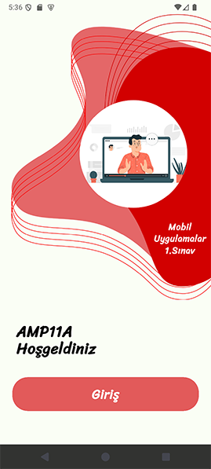

# Flutter First Exam 

<table>
<tr>
<td>

</td>
<td>

## 🎨 Proje Açıklaması

Bu proje, Flutter ile oluşturulmuş modern bir **Giriş Ekranı** tasarımı örneğidir.  
Kullanıcı giriş ekranı sade, görsel odaklı ve kullanıcı dostu bir arayüz ile tasarlanmıştır.

Proje tek bir ekran üzerinden çalışmaktadır:
- **Giriş Ekranı** – Logo, arka plan görselleri ve “Giriş” butonu içermektedir.

---

## 📂 Dosya Yapısı

```bash
├── assets/
│ ├── fonts/
│ │ └── Sriracha-Regular.ttf
│ └── images/
│ ├── back1.png
│ ├── back2.png
│ └── logo.png
│
├── lib/
│ └── main.dart # Ana uygulama dosyası
└── pubspec.yaml
```

</td>
</tr>
</table>

---

## 🧩 pubspec.yaml Ayarları

Projenin `pubspec.yaml` dosyasında assets ve fontlar aşağıdaki gibi tanımlanmalıdır:

```yaml
flutter:
  uses-material-design: true

  assets:
    - assets/images/

  fonts:
    - family: Sriracha
      fonts:
        - asset: assets/fonts/Sriracha-Regular.ttf
```

---

## ⚙️ main.dart

```dart
import 'package:flutter/material.dart';

void main() {
  runApp(const MainApp());
}

class MainApp extends StatelessWidget {
  const MainApp({super.key});

  @override
  Widget build(BuildContext context) {
    return MaterialApp(
      debugShowCheckedModeBanner: false,
      home: Scaffold(
        backgroundColor: Color(0xFFFAFEF5),
        body: SingleChildScrollView(
          child: Column(
            crossAxisAlignment: CrossAxisAlignment.start,
            children: [
              Padding(
                padding: const EdgeInsets.fromLTRB(16.0, 16.0, 0.0, 0.0),
                child: SizedBox(
                  width: double.infinity,
                  height: 568,
                  child: Stack(
                    children: [
                      SizedBox(
                        width: double.infinity,
                        height: 568,
                        child: Image.asset('assets/images/back1.png', fit: BoxFit.fill),
                      ),
                      SizedBox(
                        width: double.infinity,
                        height: 568,
                        child: Image.asset('assets/images/back2.png', fit: BoxFit.fill),
                      ),
                      Center(
                        child: Align(
                          alignment: Alignment(.5, 0),
                          child: Image.asset('assets/images/logo.png', width: 210, height: 210),
                        ),
                      ),
                      Positioned(
                        right: 10,
                        bottom: 85,
                        child: Text(
                          "Mobil\nUygulamalar\n1.Sınav",
                          textAlign: TextAlign.center,
                          style: TextStyle(
                            color: Colors.white,
                            fontSize: 18,
                            fontFamily: "Sriracha",
                            fontWeight: FontWeight.w900,
                            height: 1.3,
                          ),
                        ),
                      ),
                    ],
                  ),
                ),
              ),
              SizedBox(height: 45),
              Padding(
                padding: const EdgeInsets.only(left: 32.0),
                child: Text(
                  "AMP11A\nHoşgeldiniz",
                  textAlign: TextAlign.start,
                  style: TextStyle(
                    color: Colors.black,
                    fontSize: 30,
                    fontFamily: "Sriracha",
                    fontWeight: FontWeight.bold,
                    height: 1.1,
                  ),
                ),
              ),
              SizedBox(height: 40),
              Padding(
                padding: EdgeInsets.symmetric(horizontal: 24),
                child: FilledButton(
                  onPressed: () {},
                  style: FilledButton.styleFrom(
                    backgroundColor: const Color(0xFFE25A5A),
                    foregroundColor: Colors.white,
                    padding: EdgeInsets.all(16),
                    minimumSize: Size(double.infinity, 60),
                    shape: RoundedRectangleBorder(
                      borderRadius: BorderRadius.circular(30),
                    ),
                  ),
                  child: Text(
                    'Giriş',
                    style: TextStyle(
                      color: Colors.white,
                      fontSize: 26,
                      fontFamily: "Sriracha",
                      fontWeight: FontWeight.w900,
                      height: 1.3,
                    ),
                  ),
                ),
              ),
              SizedBox(height: 60),
            ],
          ),
        ),
      ),
    );
  }
}
